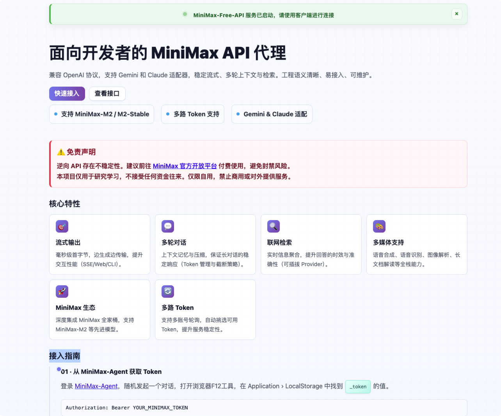
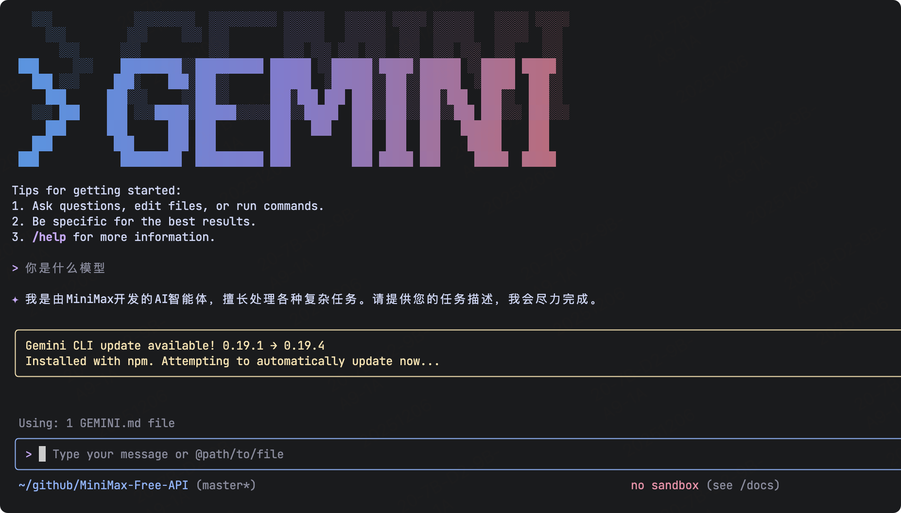
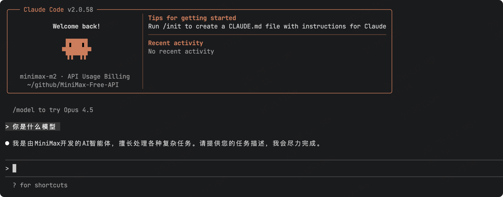

# MiniMax AI Free 服务

## 项目说明

<span>[ 中文 | <a href="README_EN.md">English</a> ]</span>

> ✨✨ 新项目[https://github.com/xiaoY233/Chat2API](https://github.com/xiaoY233/Chat2API)已经上线，后续统一进行更新维护，此项目不再更新了

支持最新MiniMax-M2、MiniMax-M2-Stable模型型，支持高速流式输出、支持多轮对话、支持语音合成、语音识别、支持联网搜索、支持长文档解读、支持图像解析，零配置部署，多路token支持，自动清理会话痕迹。


本项目由[https://github.com/LLM-Red-Team/minimax-free-api](https://github.com/LLM-Red-Team/minimax-free-api)修改而来,感谢大佬的贡献!

修改原因：
1. 原项目中官方接口[https://hailuoai.com/](https://hailuoai.com/)已更新，接口参数发生变化，API已经不可用了
2. 原项目作者账号被封，无法更新了
> 经过排查，这个原项目暂未发现恶意代码

## 更新说明

1. 更新models.ts 模型列表，支持MiniMax-M2、MiniMax-M2-Stable等最新模型
2. 将项目的所有API端点从 `https://hailuoai.com` 迁移到 `https://agent.minimaxi.com`，实现客户端通过代理服务进行AI问答交互

> PS：模型名称实际上并没啥用，只是方便和好看，实际上线上Chat调用是啥模型，就用的啥模型，模型名称随便填都可以。


### 版本说明

- v1.0.1 (2025-12-07)
    - 修复新注册账号401认证失败问题，改用realUserID和_token拼接的方式进行认证
    - 重构默认首页样式和内容，更新为新版的页面
    - 新增Gemini和Claude适配器

- v1.0.0-fix (2025-11-24)
    - 修改默认首页样式，添加接入方式和示例代码
    - 修改项目的所有API端点，基本等于重构项目
    
#### 详细更新    
1. 更新消息发送端点：
    从 /v4/api/chat/msg 改为 /matrix/api/v1/chat/send_msg
2. 调整请求数据格式：
```
    {
    "msg_type": 1,
    "text": "消息内容",
    "chat_type": 1,
    "attachments": [],
    "selected_mcp_tools": [],
    "backend_config": {}
    }
```
3. 调整响应数据解析：
```
    {
    "chat_id": 337867554939466,
    "msg_id": 337867385770195,
    "agent_pod_ip": "172.18.131.237",
    "chat_language": 2,
    "base_resp": {
        "status_code": 0,
        "status_msg": "success"
    }
    }
```
4. 移除 HTTP2 流式请求，改用标准 HTTP/1.1 SSE 或轮询
5. 调整 `messagesPrepare()`函数以匹配新格式
  
## 免责声明

**逆向API是不稳定的，建议前往MiniMax官方 https://www.minimaxi.com/platform 付费使用API，避免封禁的风险。**

**本组织和个人不接受任何资金捐助和交易，此项目是纯粹研究交流学习性质！**

**仅限自用，禁止对外提供服务或商用，避免对官方造成服务压力，否则风险自担！**

**仅限自用，禁止对外提供服务或商用，避免对官方造成服务压力，否则风险自担！**

**仅限自用，禁止对外提供服务或商用，避免对官方造成服务压力，否则风险自担！**

## 效果示例

### 服务默认首页

服务启动后，默认首页添加了接入指南和接口说明，方便快速接入，不用来回切换找文档。



### Gemini-cli接入

版本添加了gemini-cli适配器，可以直接在gemini-cli中调用API。



### Claude-code接入

版本添加了Claude-code适配器，可以直接在Claude-code中调用API。



### 验明正身Demo


### 语音合成Demo

语音合成就是创建语音


### 语音识别Demo

语音识别就是创建转录


### 多轮对话Demo


### 联网搜索Demo


### 长文档解读Demo


### 图像解析Demo


## 接入准备

从 [Minimaxi-Agent](https://agent.minimaxi.com/) 获取token

进入Minimaxi-Agent随便发起一个对话，然后F12打开开发者工具，从Application > LocalStorage中找到`_token`的值


点击user_detail_agent，找到realUserID的值，将realUserID和_token使用`+`号进行拼接，例如：450234567894+eyJhbGciOiJIUzI1NiI......

这将作为Authorization的Bearer Token值：`Authorization: Bearer TOKEN`

### 多账号接入

目前似乎限制同个账号同时只能有*一路*输出，你可以通过提供多个账号的_token并使用`,`拼接提供：

`Authorization: Bearer TOKEN1,TOKEN2,TOKEN3`

每次请求服务会从中挑选一个。

## Docker部署

请准备一台具有公网IP的服务器并将8000端口开放。

拉取镜像并启动服务

```shell
docker run -it -d --init --name minimax-free-api -p 8000:8000 -e TZ=Asia/Shanghai akashrajpuroh1t/minimax-free-api-fix:latest
```

查看服务实时日志

```shell
docker logs -f minimax-free-api
```

重启服务

```shell
docker restart minimax-free-api
```

停止服务

```shell
docker stop minimax-free-api
```

### Docker-compose部署

```yaml
version: '3'

services:
  minimax-free-api:
    container_name: minimax-free-api
    image: vinlic/minimax-free-api:latest
    restart: always
    ports:
      - "8000:8000"
    environment:
      - TZ=Asia/Shanghai
```

## 接口列表

目前支持与openai兼容的 `/v1/chat/completions` 接口，可自行使用与openai或其他兼容的客户端接入接口，或者使用 [dify](https://dify.ai/) 等线上服务接入使用。

### 对话补全

对话补全接口，与openai的 [chat-completions-api](https://platform.openai.com/docs/guides/text-generation/chat-completions-api) 兼容。

**POST /v1/chat/completions**

header 需要设置 Authorization 头部：

```
Authorization: Bearer [_token]
```

请求数据：
```json
{
    // model模型名称可以乱填
    "model": "hailuo",
    "messages": [
        {
            "role": "user",
            "content": "你是谁？"
        }
    ],
    // 如果使用SSE流请设置为true，默认false
    "stream": false
}
```

响应数据：
```json
{
    "id": "242830597915504644",
    "model": "hailuo",
    "object": "chat.completion",
    "choices": [
        {
            "index": 0,
            "message": {
                "role": "assistant",
                "content": "我是海螺AI，由上海稀宇科技有限公司（MiniMax）自主研发的AI助理。我可以帮助你回答各种问题，提供信息查询、生活建议、学习辅导等服务。如果你有任何问题，随时可以向我提问。"
            },
            "finish_reason": "stop"
        }
    ],
    "usage": {
        "prompt_tokens": 1,
        "completion_tokens": 1,
        "total_tokens": 2
    },
    "created": 1714751470
}
```

